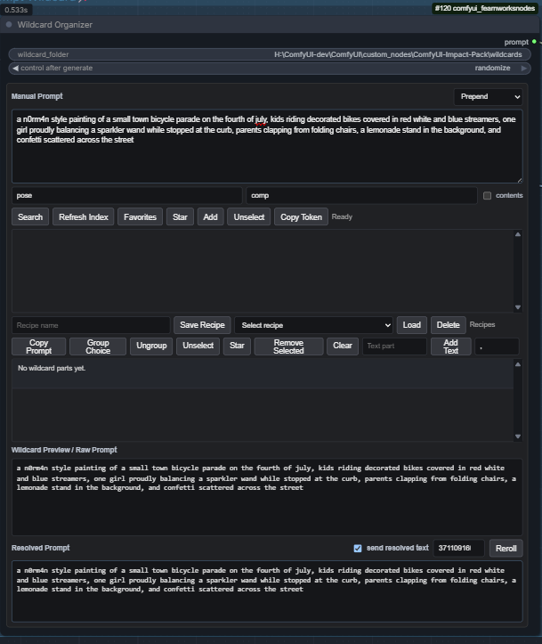
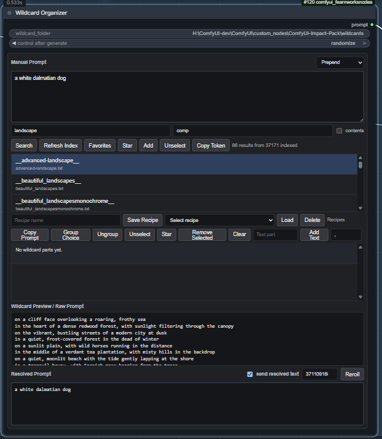
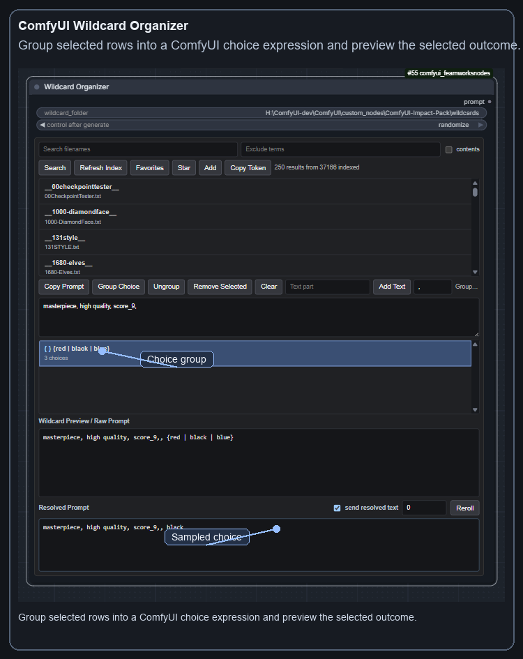
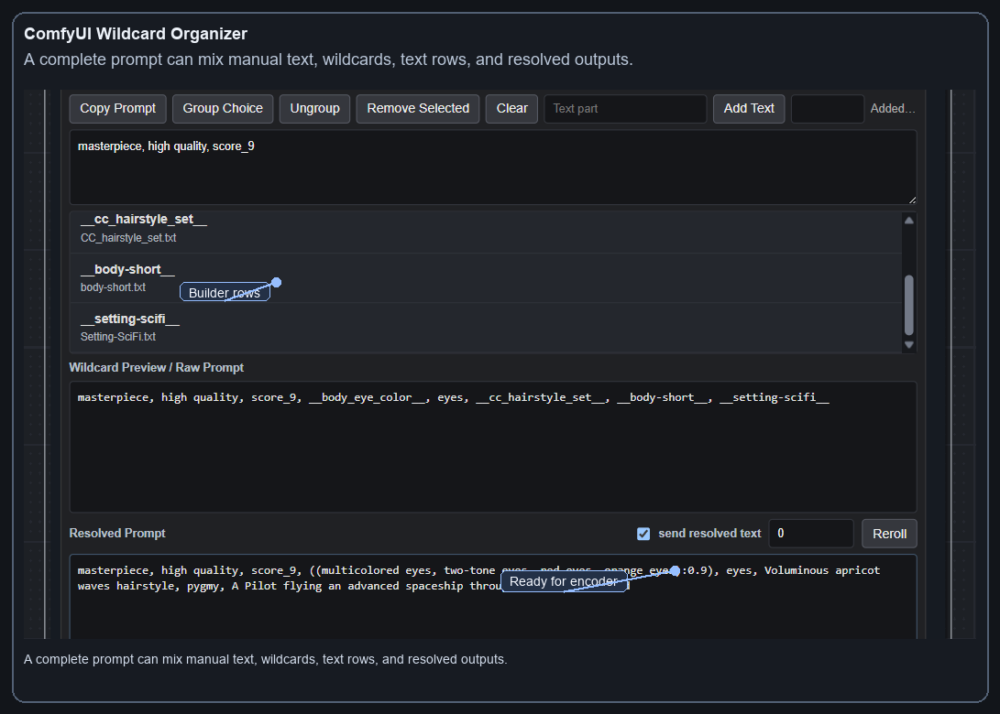

# ComfyUI Wildcard Organizer



A small ComfyUI custom node for browsing wildcard folders, composing prompts, and seeing the exact resolved prompt text before it goes into your text encoder.

## Features

- Search `.txt`, `.yaml`, and `.yml` wildcard files recursively.
- Search by wildcard key, filename, or optionally file contents.
- Preview wildcard file contents before adding a token.
- Star frequently used wildcards and custom text tags as browser-local favorites.
- Build prompts with draggable wildcard rows and literal text rows.
- Group rows into ComfyUI choice expressions like `{red | blue | black}`.
- Resolve `__wildcard__` tokens and `{choice | groups}` with a deterministic seed.
- Toggle between sending resolved text or raw wildcard expressions downstream.

## Screenshots







## Install

Clone this repository into your ComfyUI custom nodes folder:

```bash
cd ComfyUI/custom_nodes
git clone https://github.com/lokitsar/ComfyUI-WildcardOrganizer.git
```

Or download the repository as a zip and extract it so the folder is:

```text
ComfyUI/custom_nodes/ComfyUI-WildcardOrganizer
```

Then restart ComfyUI.

## Basic Use

1. Add `utils/wildcards -> Wildcard Organizer`.
2. Set `wildcard_folder` to the folder that contains your wildcard files.
3. Type a term in the search box.
4. Enable `contents` if you want the search to inspect file text too.
5. Select a result to preview it.
6. Press `Add` to put it into the prompt builder.
7. Type your main prompt in the larger `Manual Prompt` box near the top.
8. Add text rows or group selected rows into choices if useful.
9. Select builder rows and press `Star` to save reusable custom tags or wildcards.
10. Check the `Resolved Prompt` box to see the exact sampled text.
11. Connect the `prompt` output to a text encoder.

The first search builds an in-memory index for the selected wildcard folder. Later searches reuse that index instead of walking the folder again. Press `Refresh Index` after editing wildcard files.

Use `Exclude terms` to filter unwanted filenames, keys, or content. Separate terms with commas, semicolons, or new lines.

Click `Favorites` to show saved wildcard and text favorites. Click `Favorites` again to return to normal search results.

## Prompt Builder

The builder can compose the final prompt directly:

```text
masterpiece, high quality, score_9, __body_eye_color__, eyes, __cc_hairstyle_set__, __body-short__, __setting-scifi__
```

The raw prompt stays visible, while the resolved prompt shows the sampled output:

```text
masterpiece, high quality, score_9, ((multicolored eyes, two-tone eyes):0.9), eyes, Voluminous apricot waves hairstyle, pygmy, A Pilot flying an advanced spaceship through an asteroid field
```

Use `send resolved text` to choose whether the output sends the resolved prompt or the raw wildcard expression. Use `Reroll` or edit the seed to pick a different deterministic wildcard outcome.

## Wildcard Naming

The node emits normal ComfyUI wildcard tokens such as:

```text
__hair-color__
__people/hair-color__
```

For `.txt` files, wildcard keys come from the file path relative to the wildcard folder, with the extension removed:

- Backslashes are converted to `/`.
- Spaces are converted to `-`.
- Keys are lowercased.

For `.yaml` and `.yml` files, entries are expanded from YAML keys, including nested keys.

This path behavior is compatible with the common Impact Pack wildcard convention, but the node is intended for ordinary ComfyUI wildcard folders too.

## Output

The node has one output:

- `prompt`: the composed prompt string, either resolved or raw depending on the `send resolved text` checkbox.

## License

MIT
